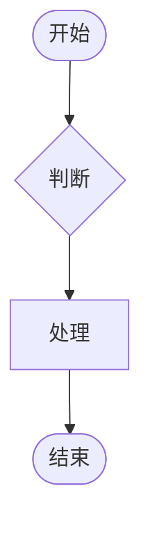
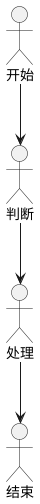

# wiki-graph

流程图 / 思维导图：节点/边模型 + 索引化存储 + 遍历 + 导出 + 布局。

图节点自适配为 `wiki_llm::TextUnit`，不反向依赖横切层。

---

## 快速上手

```rust
use wiki_graph::{Graph, GraphStore, GraphNode, NodeKind, Edge};

// 建图
let mut g = Graph::new("flow-1");
g.add_node(GraphNode::new("a", NodeKind::Start, "开始")).unwrap();
g.add_node(GraphNode::new("b", NodeKind::Decision, "判断")).unwrap();
g.add_node(GraphNode::new("c", NodeKind::Process, "处理")).unwrap();
g.add_node(GraphNode::new("d", NodeKind::End, "结束")).unwrap();

g.add_edge(Edge::new(NodeId("a".into()), NodeId("b".into()))).unwrap();
g.add_edge(Edge::new(NodeId("b".into()), NodeId("c".into()))).unwrap();
g.add_edge(Edge::new(NodeId("c".into()), NodeId("d".into()))).unwrap();

// BFS 遍历
let order = g.bfs(&NodeId("a".into()));

// 拓扑排序
let sorted = g.topological_sort().unwrap();

// 导出 Mermaid
let mermaid = g.to_mermaid();

// 导出 PlantUML
let puml = g.to_plantuml();
```

---

## 节点类型

| NodeKind | 说明 |
|---|---|
| `Start` / `End` | 流程起止 |
| `Process` | 普通步骤 |
| `Decision` | 条件判断（菱形） |
| `Idea` / `Note` | 思维导图节点 |
| `Branch` | 分支起点 |
| `Annotation` | 注释/标注 |

---

## 遍历算法

| 方法 | 说明 |
|---|---|
| `bfs(start)` | 广度优先遍历（有向可达节点） |
| `dfs(start)` | 深度优先遍历 |
| `topological_sort()` | Kahn 算法拓扑排序（DAG 环检测） |
| `neighbors(node)` | 一跳邻居（入边 + 出边） |
| `edges_from(node)` / `edges_to(node)` | 出边/入边查询 |

---

## GraphStore — 索引化存储

按 ARCHITECTURE.md §6 设计：`HashMap` + 三大倒排索引。

```rust
pub struct GraphStore {
    graphs: HashMap<String, Graph>,        // graph_id → Graph
    node_to_graph: HashMap<NodeId, String>, // node → graph 映射
    tag_index: HashMap<String, HashSet<NodeId>>,    // O(1) 按标签查
    type_index: HashMap<NodeKind, HashSet<NodeId>>, // O(1) 按类型查
}
```

```rust
let mut store = GraphStore::new();
store.create(graph).unwrap();

// 索引查询（跨图）
let auth_nodes = store.by_tag("auth");
let decisions = store.by_type(&NodeKind::Decision);
let node = store.find_node(&NodeId("c".into()));
```

---

## 导出格式

### Mermaid



### PlantUML



---

## 布局算法

| 函数 | 说明 |
|---|---|
| `tree_layout(graph, root)` | 递归树形布局（父节点居中于子节点） |
| `layered_layout(graph)` | 分层布局（拓扑排序后层内水平排列） |

返回 `LayoutResult { positions: HashMap<NodeId, (f32, f32)> }`。

---

## Embedding 策略

检索单元：**节点**（非整图）。

```
节点标签 + 注释文本
  + 父路径（思维导图）/ 上下游标签（流程图）
  → wiki-llm::embed → VectorStore upsert
     collection: "wiki_graph_nodes"
```

增量维护：`NodeInsert/NodeUpdate` → 重算该节点 + 一跳邻居。

---

## 目录

```
wiki-graph/src/
└── lib.rs     Graph / GraphNode / Edge / NodeKind / GraphStore / 遍历 / 导出 / 布局
```

## 依赖

`wiki-core` / `wiki-llm` / `serde`

Feature: `llm`（LLM 能力）/ `llm-qa`（图 RAG）/ `export`（导出）
